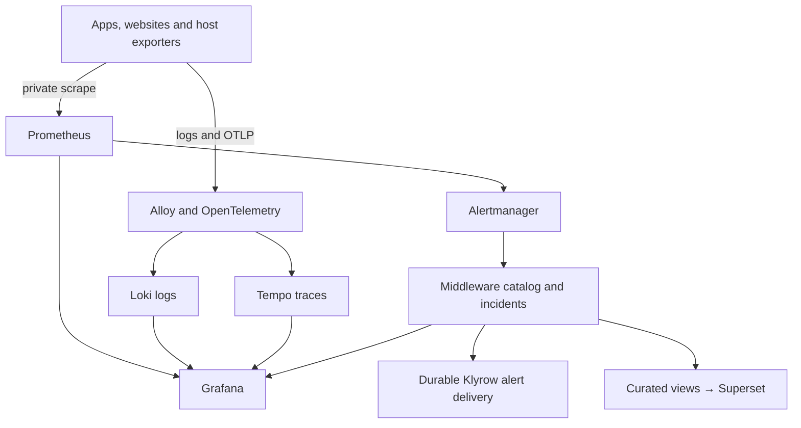
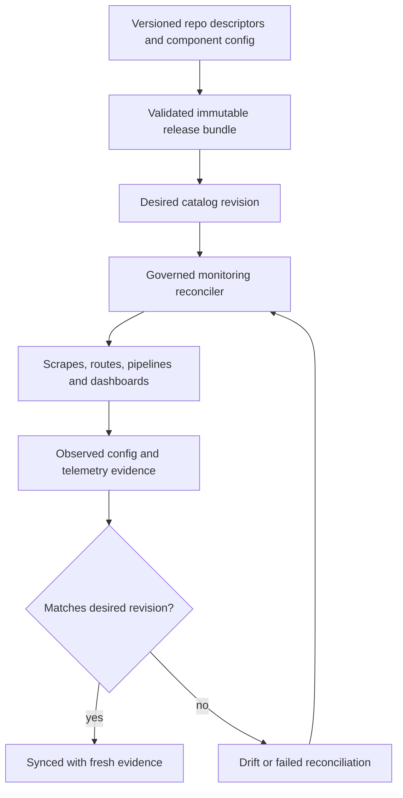

# Appolon integrated monitoring design

**Owner:** Ralph Appolon / appolon1908-hue
**Prepared:** 10 September 2026
**Status:** Integration design with 36 Middleware operations implemented in a review branch. This document does not certify production integration.

Build one operational view over the 17 monitoring repositories, backed by Middleware's service catalog and durable incident APIs. Register every deployable application, website, worker, integration and host; reconcile approved monitoring configuration from Git; verify that expected telemetry and alerts actually arrive. Keep all 63 repositories visible in the inventory, including shared libraries and deployment/configuration repositories that have no standalone runtime.

The delivered JSON contains the full repository mapping and endpoint design. It is a design inventory, not a deployment manifest. The 36 new operations are implemented in Middleware; live coverage remains unverified.

## 1. Evidence and scope

The connected GitHub inventory contains **63 unique Appolon repositories**. Seventeen are the monitoring, analytics and secrets components below. A repository may deploy several services, deploy no service, or share a host with other repositories. Report repository coverage, deployed-service coverage, endpoint coverage and host coverage separately.

SentinelX listed **four operational connected agent records** during this design session. Their public IP bindings were not verified. The earlier three-server map is retained as a planning input, not a fresh runtime inventory.

The infrastructure repository already defines Prometheus → Alertmanager, Alloy/OTel → Loki/Tempo, Grafana datasource connections, and Superset read models. Middleware source contains the service catalog, provisioning transitions, incident lifecycle, alert events and delivery callbacks. The source certification document still distinguishes endpoint source coverage from runtime proof. No production service has been changed by this design.

Sources: [Existing wiring](https://github.com/appolon1908-hue/Infustruction-repo/blob/main/docs/OBSERVABILITY-INTEGRATION-WIRING.md), [component ownership](https://github.com/appolon1908-hue/Infustruction-repo/blob/main/docs/OBSERVABILITY-AND-DASHBOARD-STACK.md), [source versus runtime certification](https://github.com/appolon1908-hue/codestra-production-platform/blob/release/production-activation/OBSERVABILITY-CERTIFICATION.md).

## 2. Integrated architecture

The operational UI uses Keycloak login through the existing Caddy ingress. Kong enforces the API route boundary and Middleware repeats authorization at the application layer. Grafana keeps its native metric/log/trace queries; the thin Observability API supplies controlled app-facing summaries, campaign views, topology and incident actions.

This is telemetry flow, not the business transaction path. Existing Odoo, n8n, provider and VICIdial integrations retain their owning APIs. Monitoring attaches identity, measurements and delivery evidence to those paths.

### Collection ownership

- **Metrics:** central Prometheus scrapes private app and exporter targets. For a service using OTLP metrics instead, the central Collector exposes a dedicated Prometheus exporter listener. Do not collect the same instrument through both paths. Collector replicas must own disjoint metric partitions or use an explicitly designed aggregation path.
- **Logs:** use Alloy for stdout/journal logs. An application choosing OTLP logs uses the Collector-to-Loki OTLP path for that same source instead. Redact before export and do not duplicate the console and SDK streams.
- **Traces:** application SDK → local Alloy receiver → central OpenTelemetry gateway → Tempo. Preserve W3C trace context across HTTP and message envelopes; use span links for asynchronous work/retries where a new trace is appropriate.
- **Alerts:** Prometheus owns rules. Alertmanager owns grouping/inhibition/silence state. Middleware owns durable incidents, audit, delivery intent and read-back. Keep one delivery policy for each alert class so multiple layers do not send duplicates.
- **Analytics:** Superset reads curated business projections. It does not become the monitoring time-series database or an operational database administration path.

OTLP uses separate traces, metrics and logs services; standard HTTP paths are `/v1/traces`, `/v1/metrics`, and `/v1/logs`, normally on port 4318. Configure receiver binding and authentication explicitly. [OTLP specification](https://opentelemetry.io/docs/specs/otlp/)

### Planned placement

| Planning target | Role | Collection design |
| --- | --- | --- |
| 65.109.65.169 | Core application host: ingress, Middleware, Odoo, automation and apps | Alloy, Node Exporter, cAdvisor; app metrics; database exporters alongside relevant databases |
| 37.27.128.39 | Central observability and existing provider workloads | Grafana, Prometheus, Alertmanager, Loki, Tempo, OTel, Superset; own host/container/provider telemetry |
| 65.21.67.207 | VICIdial/Asterisk telephony target from the recent system map | Host/container metrics where applicable; read-only adapter health, queue/agent aggregates and trunk registration evidence |
| Other connected agents and future hosts | Resolve identity, owner and placement before enrollment | Apply the appropriate profile; never infer a host solely from its hostname |

The current infrastructure design locates the fourteen `codestra.media` names at 37.27.128.39. Keep Grafana and Superset behind authenticated HTTPS. Restrict native telemetry/exporter listeners to approved private sources. Local exporters on other hosts need per-host bindings; one `node.codestra.media` name is not a fleet inventory. [Network plan](https://github.com/appolon1908-hue/Infustruction-repo/blob/main/docs/OBSERVABILITY-NETWORK-INSTALL-PLAN.md)

## 3. The 17 monitoring repository responsibilities

| Repository | Owns | Connection |
| --- | --- | --- |
| [Codestra-Grafana-](https://github.com/appolon1908-hue/Codestra-Grafana-) | Operational dashboards, datasource provisioning and drilldowns | Prometheus, Loki, Tempo → operators |
| [Codestra-Prometheus](https://github.com/appolon1908-hue/Codestra-Prometheus) | Scrapes, metric storage, recording rules and alert rules | Exporters/apps → Prometheus → Grafana and Alertmanager |
| [Codestra-Alertmanager](https://github.com/appolon1908-hue/Codestra-Alertmanager) | Grouping, inhibition, silences and receiver routing | Prometheus → durable Middleware incident API |
| [Codestra-Loki](https://github.com/appolon1908-hue/Codestra-Loki) | Sanitized logs, tenancy and retention | Alloy/OTel → Loki → Grafana |
| [Codestra-Telemetry](https://github.com/appolon1908-hue/Codestra-Telemetry) | Gateway pipelines, trace propagation, batching and redaction | SDKs/Alloy → OTel → Tempo; optional OTLP logs/metrics |
| [Codestra-Tempo](https://github.com/appolon1908-hue/Codestra-Tempo) | Trace ingestion, storage and query | OTel → Tempo → Grafana |
| [Codestra-Alloy](https://github.com/appolon1908-hue/Codestra-Alloy) | Host log collection and local OTLP forwarding | Each host → central telemetry services |
| [Codestra-Node-Exporter](https://github.com/appolon1908-hue/Codestra-Node-Exporter) | CPU, RAM, filesystem, network and host pressure | Each host → Prometheus |
| [Codestra-cAdvisor](https://github.com/appolon1908-hue/Codestra-cAdvisor) | Container resource use and runtime inventory | Each container host → Prometheus |
| [Codestra-Redis-Exporter](https://github.com/appolon1908-hue/Codestra-Redis-Exporter) | Redis availability, memory, persistence and connections | Each Redis deployment → Prometheus |
| [Codestra-Postgres-Exporter](https://github.com/appolon1908-hue/Codestra-Postgres-Exporter) | Database availability, pools, locks, replication and storage | Each PostgreSQL deployment → Prometheus |
| [Codestra-Blackbox-Exporter](https://github.com/appolon1908-hue/Codestra-Blackbox-Exporter) | Registered HTTP/TLS/DNS/TCP availability probes | Approved website/API targets → Prometheus |
| [Superset](https://github.com/appolon1908-hue/Superset) | Business analytics over curated read models | Read-only analytics views → business users |
| [Codestra-OpenBao](https://github.com/appolon1908-hue/Codestra-OpenBao) | Workload secrets and PKI; non-secret health monitoring | Machine identities → secret references; health → Prometheus |

Component repos remain authoritative for their own configuration. `Infustruction-repo` owns shared topology, networks, storage and placement. `Middleware-` owns the catalog, authorization and incident APIs. `SDK-repository` distributes application instrumentation helpers. `codestra-production-platform` and the existing runtime-authority repo bind approved release identities and deployment evidence. Do not copy competing versions of Prometheus rules or Grafana dashboards into the infrastructure repo.

## 4. Register every service once

Each app repo supplies a versioned `service.yaml` descriptor and a release-specific OpenAPI artifact when it has an HTTP API. The descriptor declares owner, deployable units, environments, dependencies, classification, endpoint references, metrics/log/trace profile, SLO, alert route and dashboard template. The deployed service catalog is a materialized view of approved Git descriptors plus runtime observations.

Use a stable `service_id` and separate `deployment_id`, `host_id`, `environment` and `instance_id`. Keep `repository_id` independent. Registration must identify actual origins from deployment configuration; do not derive a live URL from a repository name.

Current `ServiceCreate` already supports service ID, owner, tenancy, type, repository, environments, health/metrics/OpenAPI paths, dependencies, data classification, SLO profile and alert profile. Its health default is `/health/ready`, while the incident service contract uses `/readiness`. Preserve actual paths in the catalog rather than renaming running services to fit an assumption. The current PATCH model updates only a subset of fields; broader descriptor changes need an explicit compatible API extension. [Service catalog source](https://github.com/ingtrader21-spec/Middleware-/blob/main/app/api/v1/platform.py)

Proposed extension records: approved public/private origins; host bindings; liveness and readiness paths separately; collection owner per signal; contract digest; expected and observed Git SHA/image digest/config digest/migration head; last successful observation; dashboard IDs; probe target IDs; and a reason for each non-applicable signal. Host, library and exporter resources may need separate resource types because the current service type enum is limited.

The JSON includes an Odoo example split into the existing create fields and a proposed extension. The example paths and service dependency IDs must be bound to real adapters and contracts during onboarding; it is not a request to send directly to production.

### Coverage by workload

| Workload | Required coverage |
| --- | --- |
| API/backend | Registered method/path contract; readiness and liveness; request/error/latency metrics; dependency metrics; logs; traces; alert and dashboard |
| Website/frontend | Public DNS/TLS/HTTP probe; expected content or version artifact; browser errors and performance where supported; BFF/API dependencies; release identity |
| Worker/scheduled job | Heartbeat, last successful run, duration, queue lag, retry/DLQ age; logs and linked traces; no invented public HTTP API |
| WebSocket service | Upgrade availability, active sessions, reconnects, delivery lag and authorization failures; bounded internal synthetic handshake |
| Database/cache | Dedicated exporter, backup/restore evidence, storage growth, replication or persistence health; monitoring-only identity |
| Library/docs/config repo | CI, signed release/artifact identity, consumer mapping and configuration drift; runtime metrics marked not applicable with reason |
| External provider | Owned adapter health, timeout/error/queue metrics and read-back; approved external availability checks only |

### Onboarding flow

1. Import the descriptor and immutable contract from the service's approved release.
2. Validate stable identity, ownership, dependencies, origins and the applicable profile.
3. Generate a reviewable monitoring bundle: target declarations, recording/alert rules, log routing, trace identity, dashboard bindings and role mappings.
4. Run component validators and contract tests; deploy through the existing provisioning/release workflow.
5. Read back each component's active configuration and emit one sanitized test event/trace/log through a designated test fixture.
6. Mark monitoring certified only after freshness, query retrieval, alert routing and permissions are proven. An imported Git descriptor alone stays `registered`.

## 5. Keep integration and configuration synchronized

Git events update desired state; controller read-back updates observed state. A signed webhook is an inventory trigger, not automatic authority to deploy any incoming branch. Bind changes to approved artifacts, compatible schemas and exact component versions. Do not synchronize repositories by copying code or force-updating their branches.

Use a durable outbox/inbox for catalog and deployment events. Event fields include `event_id`, `schema_version`, `service_id`, `environment`, `source_deployment`, `occurred_at`, `observed_at`, `correlation_id`, `desired_revision`, `observed_revision` and a payload digest. Use at-least-once delivery with idempotent consumers; retain source sequence/epoch or revision ordering so delayed events cannot overwrite newer state.

The reconciler reports each component independently: `pending`, `applying`, `synced`, `drifted`, `failed`, or `unknown`. Preserve the previous valid configuration if a validation/reload fails. The runtime controller must read back actual targets, datasource bindings, rules and collector configuration rather than accepting an HTTP 200 as proof of complete wiring. API apply transitions already in source do not establish that this controller exists.

Proposed initial timings: 15-second metric scrapes, 30-second heartbeats, stale after 90 seconds, 60-second website probes, event-driven updates plus reconciliation every 5 minutes, and a daily inventory comparison. These are tunable design defaults, not measured performance or an installed schedule. Dashboard data must show the observation timestamp and stale/unknown states explicitly.

## 6. API and endpoint design

There are three distinct inventories: existing Middleware routes confirmed in source; implemented platform extensions; and native component APIs. `source-confirmed` does not mean live. Business APIs from all application repos are imported from each release's OpenAPI document and matched to deployed Kong routes; this document does not invent a complete list of their business operations.

### Existing Middleware contracts to reuse

| Method | Path | Purpose |
| --- | --- | --- |
| POST | `/v1/integrations/alertmanager/events` | Persist Alertmanager transitions as durable operations |
| POST | `/v1/integrations/alertmanager/status-events` | Persist authenticated Alertmanager v2 suppression state |
| GET | `/health` | healthObservabilityAlerts |
| HEAD | `/health` | headHealthObservabilityAlerts |
| GET | `/readiness` | readinessObservabilityAlerts |
| GET | `/version` | versionObservabilityAlerts |
| GET | `/capabilities` | capabilitiesObservabilityAlerts |
| GET | `/metrics` | metricsObservabilityAlerts |
| POST | `/v1/observability/alerts` | Persist one Alertmanager transition as one durable command (deprecated alias) |
| GET | `/v1/observability/alerts/{operation_id}` | getObservabilityAlert |
| GET | `/v1/observability/alerts/{operation_id}/events` | listObservabilityAlertEvents |
| GET | `/v1/observability/incidents` | List tenant-scoped incidents with bounded keyset pagination |
| GET | `/v1/observability/incidents/{incident_id}` | getObservabilityIncident |
| GET | `/v1/observability/incidents/{incident_id}/timeline` | listObservabilityIncidentTimeline |
| GET | `/v1/observability/incidents/{incident_id}/notification-attempts` | listObservabilityNotificationAttempts |
| POST | `/v1/observability/incidents/{incident_id}/acknowledge` | acknowledgeObservabilityIncident |
| POST | `/v1/observability/incidents/{incident_id}/resolve` | resolveObservabilityIncident |
| POST | `/v1/observability/incidents/{incident_id}/reopen` | reopenObservabilityIncident |
| POST | `/v1/observability/alert-delivery-events` | Durably ingest a Klyrow alert delivery event |
| GET | `/platform/v1/services` | List registered services |
| POST | `/platform/v1/services` | Register a service |
| GET | `/platform/v1/services/{service_id}` | Read service metadata |
| PATCH | `/platform/v1/services/{service_id}` | Update supported service fields |
| POST | `/platform/v1/services/{service_id}/environments` | Register service environment |
| POST | `/platform/v1/services/{service_id}/activate` | Activate a certified service registration |
| POST | `/platform/v1/services/{service_id}/decommission` | Retire a service registration |
| POST | `/platform/v1/provisioning/requests` | Create a provisioning request |
| GET | `/platform/v1/provisioning/requests/{request_id}` | Read provisioning evidence/state |
| POST | `/platform/v1/provisioning/requests/{request_id}/validate` | Submit certification evidence |
| POST | `/platform/v1/provisioning/requests/{request_id}/approve` | Approve the validated request |
| POST | `/platform/v1/provisioning/requests/{request_id}/apply` | Record/execute the governed apply transition |
| POST | `/platform/v1/provisioning/requests/{request_id}/rollback` | Record/execute the governed rollback transition |

The exact alert schemas remain in [alert-api.v1.openapi.yaml](https://github.com/ingtrader21-spec/Middleware-/blob/main/contracts/observability/alert-api.v1.openapi.yaml). Preserve incident state, expected-version concurrency, delivery intent and replay behavior rather than replacing them with a second incident model.

### Extensions implemented in the review branch

All routes below are design work to implement and certify. Paths use the existing `/platform/v1` and `/v1/observability` conventions.

| Method | Path | Purpose |
| --- | --- | --- |
| GET | `/platform/v1/repositories` | Repository ownership, CI and release inventory |
| GET | `/platform/v1/hosts` | Registered hosts and freshness |
| GET | `/platform/v1/hosts/{host_id}` | Host identity, placements and collector status |
| GET | `/platform/v1/services/{service_id}/deployments` | Desired and observed service releases |
| GET | `/platform/v1/services/{service_id}/endpoints` | Method/path inventory from the release OpenAPI document |
| GET | `/platform/v1/services/{service_id}/dependencies` | Declared and observed integration edges |
| GET | `/platform/v1/services/{service_id}/coverage` | Applicable monitoring requirements and evidence |
| POST | `/platform/v1/services/{service_id}/telemetry-profile` | Stage a versioned monitoring-profile change |
| POST | `/platform/v1/services/{service_id}/contract-refresh` | Import contract only from an approved release artifact/target |
| GET | `/platform/v1/sync/status` | Desired/observed revisions, lag and drift |
| POST | `/platform/v1/sync/reconciliations` | Request a bounded reconciliation of approved monitoring configuration |
| GET | `/platform/v1/sync/reconciliations/{reconciliation_id}` | Per-component reconcile result and evidence |
| POST | `/platform/v1/integrations/github/events` | Signed GitHub webhook ingestion for inventory/release state |
| POST | `/platform/v1/runtime/observations` | Signed controller observations of deployment identities |
| POST | `/platform/v1/telemetry/heartbeats` | Collector/service freshness and collection offsets |
| GET | `/v1/observability/overview` | System coverage, freshness and active incidents |
| GET | `/v1/observability/services/{service_id}/health` | Separate liveness, readiness and dependency health |
| GET | `/v1/observability/topology` | Scoped service/dependency topology |
| POST | `/v1/observability/metrics/query` | Bounded instant query or named query template |
| POST | `/v1/observability/metrics/query-range` | Bounded time-series query |
| POST | `/v1/observability/logs/query` | Bounded and redacted log search |
| GET | `/v1/observability/traces/{trace_id}` | Authorized trace lookup with tenant verification |
| POST | `/v1/observability/traces/search` | Bounded trace search |
| GET | `/v1/observability/slo` | SLO compliance and remaining error budget |
| GET | `/v1/observability/dashboards` | Authorized dashboard links and provisioning version |
| GET | `/v1/observability/certificates` | DNS/TLS inventory, issuer and expiry |
| GET | `/v1/observability/backups` | Backup freshness and latest verified restore evidence |
| GET | `/v1/observability/secrets/health` | OpenBao availability/seal/lease health with no secret values |
| GET | `/v1/observability/integrations` | Contract, auth, queue, delivery and reconciliation status |
| GET | `/v1/observability/integrations/{integration_id}` | One integration, including desired/observed revision |
| GET | `/v1/observability/agents` | Odoo/VICIdial username, campaign and presence projection |
| GET | `/v1/observability/campaigns/{campaign_id}` | Campaign-scoped queue and integration summary |
| GET | `/v1/observability/events/stream` | Authorized server-sent events for incident/health changes |
| POST | `/v1/observability/probe-runs` | Request a read-only probe against a registered target ID |
| GET | `/v1/observability/probe-runs/{probe_run_id}` | Read bounded synthetic-probe evidence |
| POST | `/v1/telemetry/browser-events` | Same-origin browser error/performance intake via app BFF |

### Native monitoring interfaces

Use a typed, version-aware adapter for each backend. Do not expose a generic arbitrary-URL proxy. Internal port numbers below are common defaults, not verified deployment bindings or a firewall change request.

| Component | Internal port | Required interfaces |
| --- | --- | --- |
| Codestra-Prometheus | 9090 | `GET /api/v1/query`; `GET /api/v1/query_range`; `GET /api/v1/targets`; `GET /api/v1/rules`; `GET /api/v1/alerts`; `GET /api/v1/alertmanagers`; `GET /api/v1/status/buildinfo`; `GET /metrics` |
| Codestra-Alertmanager | 9093 | `POST /api/v2/alerts`; `GET /api/v2/alerts`; `GET /api/v2/status`; `GET /api/v2/silences`; `POST /api/v2/silences`; `DELETE /api/v2/silence/{silenceID}`; `GET /metrics` |
| Codestra-Loki | 3100 | `POST /loki/api/v1/push`; `POST /otlp/v1/logs`; `GET /loki/api/v1/query_range`; `GET /loki/api/v1/labels`; `GET /ready`; `GET /metrics` |
| Codestra-Tempo | 3200 query; OTLP receivers configured separately | `GET /api/traces/{trace_id}`; `GET /api/v2/traces/{trace_id}`; `GET /api/search`; `GET /ready`; `GET /metrics` |
| Codestra-Telemetry | 4317 gRPC; 4318 HTTP; exporter listener configured separately | `OTLP/gRPC TraceService.Export`; `OTLP/gRPC MetricsService.Export`; `OTLP/gRPC LogsService.Export`; `POST /v1/traces`; `POST /v1/metrics`; `POST /v1/logs` |
| Codestra-Alloy | configured local listener | `OTLP on configured 4317/4318 listeners`; `GET /metrics on configured management listener` |
| Codestra-Node-Exporter | 9100 | `GET /metrics` |
| Codestra-cAdvisor | 8080 | `GET /metrics` |
| Codestra-Redis-Exporter | 9121 | `GET /metrics` |
| Codestra-Postgres-Exporter | 9187 | `GET /metrics` |
| Codestra-Blackbox-Exporter | 9115 | `GET /probe?module={approved_module}&target={registered_target}`; `GET /metrics` |
| Codestra-Grafana- | 3000 behind Caddy | `GET /api/health`; `Version-matched dashboard and datasource provisioning APIs` |
| Superset | 8088 behind Caddy | `GET /health`; `GET /api/v1/dashboard/`; `GET /api/v1/chart/` |
| Codestra-OpenBao | 8200 protected | `GET /v1/sys/health`; `GET /v1/sys/metrics?format=prometheus` |

Prometheus provides the query and target APIs above. Loki supports both native push and OTLP log ingestion; configure the Collector's Loki OTLP exporter base endpoint as `/otlp`, allowing it to append `/v1/logs`. Tempo's query frontend supports trace lookup and search; OTLP trace ingestion is a separate receiver. [Prometheus API](https://prometheus.io/docs/prometheus/latest/querying/api/), [Loki API](https://grafana.com/docs/loki/latest/reference/loki-http-api/), [Tempo API](https://grafana.com/docs/tempo/latest/api_docs/)

Grafana's current documentation describes migration from legacy `/api` management endpoints toward `/apis`. Pin the Grafana version and resolve its provisioning adapter against that version; do not hardcode one dashboard-management API for every release. [Grafana API lifecycle](https://grafana.com/docs/grafana/latest/developer-resources/api-reference/http-api/api-legacy/other/)

Keycloak's discovery endpoint is `/realms/{realm}/.well-known/openid-configuration`; token and JWKS endpoints are obtained from that document. Bind the actual issuer/audience/client rather than guessing a production realm. [Keycloak OIDC endpoints](https://www.keycloak.org/securing-apps/oidc-layers)

### Contract and response rules

For each extension publish OpenAPI with request/response schemas, operation ID, scope, pagination, bounds, errors and compatibility version. Contract CI checks backward compatibility, request validation, tenant/campaign authorization and method/path coverage. GraphQL, WebSocket or asynchronous services may attach their appropriate versioned schemas alongside OpenAPI.

Reads return `data`, `observed_at`, `freshness`, `source_revision` and `correlation_id`; lists include a cursor. Partial backend failure is represented per component, with no zero/green substitution for absent evidence. Use 401/403 for identity/authority, 409 for revision or idempotency conflict, 422 for invalid input, 429 for limits and 503 for unavailable dependencies. Use bounded 202 operation resources for asynchronous work.

Implemented monitoring mutations require a correlation ID and idempotency key; changes to desired configuration use expected revision/If-Match. Existing routes retain their established schema unless a compatible extension is explicitly added. Store a canonical payload digest and reject changed payloads under a reused idempotency key. Return the original outcome on retries without changing present state.

Suggested query limits: 24-hour default/7-day maximum interactive window, 5-second backend timeout, 1,000 log rows and 10,000 series points per response, cursor pagination, bounded concurrency and explicit retention limits. These are starting budgets to measure under load. Platform operators may use controlled PromQL/LogQL; campaign users use named query templates or scoped projections. Never append a tenant string to arbitrary queries and assume isolation.

## 7. Connect each business system

| System | Operational signals and integration proof |
| --- | --- |
| Odoo ↔ Middleware | RPC/API latency, authentication, outbox/inbox age, event revision, successful reconciliation and adapter readiness |
| Middleware ↔ n8n | Workflow availability, job start/end, executions failed, retries, callback lag and correlation continuity |
| Middleware ↔ VICIdial/Asterisk | Adapter authentication/readiness, agent/queue aggregates, trunk registration and call-result reconciliation |
| Middleware ↔ Klyrow/Telnexa | Email/SMS/provider API latency, queue/DLQ age, delivery callback lag and authoritative read-back |
| Caddy ↔ Kong ↔ app | DNS/TLS, request rate/error/latency, route-to-service mapping, upstream readiness and release identity |
| Keycloak ↔ every protected UI/API | Discovery/JWKS freshness, token exchange, login/logout, role mapping, denied access and session expiry |
| Marketing/AI/social services | Job latency, rate limits, provider errors, queue age, token/cost aggregates when available, completion/read-back |
| All business websites/apps | Public availability, content/version check, browser errors/performance, API dependency health and latest deployed release |
| PostgreSQL/Redis | Monitoring exporter plus backup freshness, restore proof, connection pressure and persistence/replication |

An integration record contains source and target service IDs, contract version, authentication audience/scope, last successful handshake, queue backlog/oldest age, last successful business result, and last reconciliation. Show transport connectivity, authentication, contract compatibility and completed business delivery as separate states.

For agent monitoring, provide `agent_id`, `username`, `campaign_id`, `active`, `presence`, `source_observed_at` and `stale` through the scoped Middleware projection. The campaign supervisor sees only their campaign; global admin retains the established read-only visibility. Raw usernames, phone numbers, customer IDs and trace IDs do not become Prometheus labels. Aggregate campaign counts are allowed only with bounded dimensions.

Registered probes are read-only. Availability checks never place calls, send email/SMS, submit leads or start paid trading/workflow actions. An active business delivery test uses the system's existing separate controlled execution path and records its outcome.

## 8. Identity and isolation

Keycloak provides human login and machine identities. Use Caddy for HTTPS and Kong for API authentication/rate policy, followed by Middleware audience, issuer, expiry, scope, role and tenant/campaign checks. Machine credentials live in OpenBao or the existing approved secret-injection mechanism; browser applications receive no telemetry backend credentials.

The existing alert source is the `alertmanager` client with tenant `codestra-platform`, audience `middleware-api`, and scopes `alerts.write/read`; the delivery-event adapter (`klyrow-alert-adapter`) uses `observability.alerts.events.write` and `observability.alerts.read`. Keep these current names. New read scopes and sync scopes in the JSON are proposed additions, not claims about existing Keycloak roles.

Prometheus OSS is not a tenant-isolation boundary. Grafana folders and dashboard filters alone do not isolate datasource queries. Platform operators can access the shared operational backends; restricted campaign/application users must go through authorized query templates/projections or genuinely isolated datasource/store boundaries. For Loki/Tempo, derive backend tenant context from verified identity and use version-supported isolation; do not trust caller-supplied tenant headers. Recheck the tenant owning a trace before returning it.

OpenBao monitoring reads non-secret health and metrics only. It receives no unseal, recovery, root-token or secret-read privileges. Instrumentation removes credentials, Authorization headers, signed URLs, message contents, payment details and personal contact information before they reach storage.

## 9. Alert delivery and monitoring the monitor

Reuse the existing normal path: Prometheus → Alertmanager → `/v1/integrations/alertmanager/events` → durable Middleware incident/command/outbox → existing command executor/Temporal → Klyrow adapter → private email API → provider read-back. The current source policy fixes sender `alerts@codestra.co` and recipient `appolon@codestra.co`. No messages are sent by this design. [Alert delivery authority](https://github.com/ingtrader21-spec/Middleware-/blob/main/docs/observability/ALERT-DELIVERY-ARCHITECTURE.md)

The status collector separately reconciles native Alertmanager inhibition/silence evidence through `/v1/integrations/alertmanager/status-events`. A firing/resolved webhook alone cannot reproduce all suppression state. Keep source deployment, occurrence start time and observation ordering intact. A provider timeout remains unknown/reconciliation-required until read-back proves the outcome. [Incident authority](https://github.com/ingtrader21-spec/Middleware-/blob/main/docs/OBSERVABILITY-INCIDENTS-V1.md)

Require `service`, `environment`, `severity`, `owner` and runbook metadata for production alert definitions. Reject incomplete rules in CI. If runtime alert labels are incomplete, retain the incident, mark its routing metadata invalid and route it to the platform fallback receiver under a restricted policy; never silently discard it or guess another tenant.

The source documents differ in severity wording: the incident model mentions critical/high/warning/info while the fixed email architecture allows critical/warning. Resolve this through one versioned severity-normalization contract and tests; do not silently invent notification behavior for `high`.

Loss of Middleware or Klyrow can also break the normal alert path. Design an independent watchdog receiver outside the primary failure domain for monitor/host/primary-delivery loss. The repo says this emergency path is not implemented; it needs its own fixed recipient, bounded policy and independent verification. Four connected agents do not prove independent failure domains or highly available storage.

### Initial alert families

Host/container pressure and restarts; service/readiness failures; DNS/TLS errors and expiry; unexpected authentication failures; release/config drift; collector heartbeat or scrape loss; missing logs/traces; outbox/inbox/queue oldest age; retry/DLQ growth; provider read-back failures; stale agent presence; backup/restore evidence age; database/cache failures; pipeline export errors; monitoring storage capacity; and failure of alert delivery itself.

## 10. Operational screen design

Use a clean Appolon operations shell consistent with the requested restrained black/white visual style. Show data freshness next to status and use color only with clear text labels.

| View | What the operator sees |
| --- | --- |
| Overview | Coverage by repository/service/host, active incidents, stale data and failed integration edges |
| Services & websites | Owner, environment, release, host, HTTPS, readiness, metrics/logs/traces and dashboard link |
| Integration map | Source → target, auth/contract state, queue lag and last completed/reconciled result |
| APIs | Service/method/route, release OpenAPI digest, runtime route match, error/latency and coverage gaps |
| Incidents | Firing/acknowledged/resolved/suppressed state, timeline, owner and notification read-back |
| Hosts & data | CPU/memory/disk, containers, databases/cache, capacity and backup/restore evidence |
| Campaigns | Authorized username/campaign/presence projection plus queue and adapter health |
| Sync & releases | Expected versus observed SHA/digest/config/migration, component failures and rollback reference |

Do not show a single green “fully integrated” badge while any applicable signal is stale, any mandatory edge lacks proof, or a notification has an unknown outcome. Use `unknown`, `not applicable` and `not deployed` as explicit states.

## 11. Reliability, retention and growth

Telemetry export is asynchronous with bounded buffers, timeouts and backpressure. Collection/storage outages must not block Odoo, calls or customer HTTP requests. Persist appropriate collector queues/checkpoints and monitor drops; signals are not promised exactly-once. Use trace sampling appropriate to volume and incident needs, preserving error traces where the selected sampling design allows it.

Keep existing approved retention policies authoritative. Measure compressed bytes/day, active series, samples/sec, log volume and trace volume before choosing retention or expanding the central host. Size storage from measured daily volume × retained days × replication/overhead plus working headroom. Set explicit disk and ingestion budgets per service. Staging and production keep separate storage/credential boundaries.

Back up catalog/incident state, configuration and material operational data according to the existing recovery policy. Backblaze backup evidence must distinguish uploaded ciphertext, checksum read-back, accessible recovery key and a successful isolated restore; one is not proof of the others. Monitoring should surface each separately.

For later high availability, budget independent failure domains, replicated databases/object storage and collector/backend topology explicitly. A second dashboard or extra exporter does not make the central metrics/log/trace stores highly available.

## 12. Implementation order and completion evidence

| Order | Deliverable and owning repos | Required proof |
| --- | --- | --- |
| 1 | Alertmanager → Middleware → Klyrow routing; Codestra-Prometheus, Codestra-Alertmanager, Middleware-, Keycloak, klyrow.com | Firing/resolved incident and durable delivery read-back; missing-label fallback; suppressed-state reconciliation; independent monitor failure design |
| 2 | Catalog and fleet coverage; Middleware-, SDK-repository, Infustruction-repo, runtime authority | Every repo classified; every deployable service mapped to actual host/origin; no unexplained coverage gaps |
| 3 | Exporters, targets and website probes; five exporter repos plus Prometheus | Targets read back with correct labels; private reachability; approved DNS/TLS/HTTP checks |
| 4 | Logs/traces and operator view; Alloy, Telemetry, Loki, Tempo, Grafana, Caddy, Keycloak | Correlated log and trace retrievable; no duplicate sources; HTTPS and role-correct login |
| 5 | Thin Observability API, integration/campaign views and sync controller; Middleware-, Websocket- only if reused, Odoo and adapters | Typed queries, isolation tests, freshness/lag display, drift detection and verified reconciliation |
| 6 | Superset and OpenBao completion; dedicated repos and infrastructure | Curated read-only analytics, Keycloak access; secret custody/recovery prerequisites and non-secret monitoring |

Each application repo adds its own instrumentation and versioned descriptor. Component repos supply immutable config packages. The deployment platform assembles a release lock listing each repo SHA, image digest, config digest, contract digest and schema head. Rollback references the last compatible approved release and preserves incident evidence; database changes use existing backup/migration/restore gates.

Completion requires all of the following: inventory completeness; expected versus observed contract parity; successful scrape, log and trace retrieval where applicable; working auth boundaries; real alert delivery/read-back; no silent failures when a monitoring dependency is down; verified release identity; and rollback evidence. Contract-test success alone does not certify live coverage.

## 13. Full 63-repository design inventory

The repository names below were observed from GitHub. The group/profile is a proposed design assignment, not a deployment assertion. All runtime coverage remains unverified in this blueprint. Shared-source repos are linked to consumers and release evidence rather than forced to expose meaningless health endpoints.

| # | Repository | Design group | Monitoring profile |
| --- | --- | --- | --- |
| 1 | [Frontend-Resturant-](https://github.com/appolon1908-hue/Frontend-Resturant-) | Applications/websites | runtime-or-website |
| 2 | [codestra-production-platform](https://github.com/appolon1908-hue/codestra-production-platform) | Runtime and shared source | runtime-or-website |
| 3 | [Codestraxxxx](https://github.com/appolon1908-hue/Codestraxxxx) | Classification pending | classify-before-target-registration |
| 4 | [codestra](https://github.com/appolon1908-hue/codestra) | Classification pending | classify-before-target-registration |
| 5 | [beyvra-backend](https://github.com/appolon1908-hue/beyvra-backend) | Applications/websites | runtime-or-website |
| 6 | [codestra-backend](https://github.com/appolon1908-hue/codestra-backend) | Applications/websites | runtime-or-website |
| 7 | [backend2](https://github.com/appolon1908-hue/backend2) | Classification pending | classify-before-target-registration |
| 8 | [beyvra-frontend](https://github.com/appolon1908-hue/beyvra-frontend) | Applications/websites | runtime-or-website |
| 9 | [scrapper](https://github.com/appolon1908-hue/scrapper) | Archival source | release-and-dependency |
| 10 | [Breero.com](https://github.com/appolon1908-hue/Breero.com) | Applications/websites | runtime-or-website |
| 11 | [booked4seasons](https://github.com/appolon1908-hue/booked4seasons) | Classification pending | classify-before-target-registration |
| 12 | [kyqra](https://github.com/appolon1908-hue/kyqra) | Archival source | release-and-dependency |
| 13 | [telnexa](https://github.com/appolon1908-hue/telnexa) | Platform/integrations | runtime-or-website |
| 14 | [kyqra-crawler](https://github.com/appolon1908-hue/kyqra-crawler) | Applications/websites | runtime-or-website |
| 15 | [klyrow.com](https://github.com/appolon1908-hue/klyrow.com) | Platform/integrations | runtime-or-website |
| 16 | [codestra-provisioning-service](https://github.com/appolon1908-hue/codestra-provisioning-service) | Platform/integrations | runtime-or-website |
| 17 | [Moneybee-frontend-](https://github.com/appolon1908-hue/Moneybee-frontend-) | Applications/websites | runtime-or-website |
| 18 | [Moneybee-Backend](https://github.com/appolon1908-hue/Moneybee-Backend) | Applications/websites | runtime-or-website |
| 19 | [transportaion-Frontend](https://github.com/appolon1908-hue/transportaion-Frontend) | Applications/websites | runtime-or-website |
| 20 | [transportation-backend-](https://github.com/appolon1908-hue/transportation-backend-) | Applications/websites | runtime-or-website |
| 21 | [LARIM-A-Fornt-end](https://github.com/appolon1908-hue/LARIM-A-Fornt-end) | Applications/websites | runtime-or-website |
| 22 | [LARIM-A-Backend](https://github.com/appolon1908-hue/LARIM-A-Backend) | Applications/websites | runtime-or-website |
| 23 | [Telnexa-web](https://github.com/appolon1908-hue/Telnexa-web) | Applications/websites | runtime-or-website |
| 24 | [klyrow-Website-](https://github.com/appolon1908-hue/klyrow-Website-) | Applications/websites | runtime-or-website |
| 25 | [Odoo](https://github.com/appolon1908-hue/Odoo) | Platform/integrations | runtime-or-website |
| 26 | [Keycloak](https://github.com/appolon1908-hue/Keycloak) | Platform/integrations | runtime-or-website |
| 27 | [Middleware-](https://github.com/ingtrader21-spec/Middleware-) | Platform/integrations | runtime-or-website |
| 28 | [N8N](https://github.com/appolon1908-hue/N8N) | Platform/integrations | runtime-or-website |
| 29 | [Vicidialer-Codestra](https://github.com/appolon1908-hue/Vicidialer-Codestra) | Platform/integrations | runtime-or-website |
| 30 | [Kong](https://github.com/appolon1908-hue/Kong) | Platform/integrations | runtime-or-website |
| 31 | [social.codestra.co](https://github.com/appolon1908-hue/social.codestra.co) | Platform/integrations | runtime-or-website |
| 32 | [SDK-repository](https://github.com/appolon1908-hue/SDK-repository) | Runtime and shared source | runtime-or-website |
| 33 | [Caddy](https://github.com/appolon1908-hue/Caddy) | Platform/integrations | runtime-or-website |
| 34 | [documentaions](https://github.com/appolon1908-hue/documentaions) | Governance/shared source | release-and-dependency |
| 35 | [Infustruction-repo](https://github.com/appolon1908-hue/Infustruction-repo) | Governance/shared source | release-and-dependency |
| 36 | [communication-platform-](https://github.com/appolon1908-hue/communication-platform-) | Governance/shared source | release-and-dependency |
| 37 | [Codestra-Grafana-](https://github.com/appolon1908-hue/Codestra-Grafana-) | Monitoring | native-component |
| 38 | [Codestra-Prometheus](https://github.com/appolon1908-hue/Codestra-Prometheus) | Monitoring | native-component |
| 39 | [Codestra-Alertmanager](https://github.com/appolon1908-hue/Codestra-Alertmanager) | Monitoring | native-component |
| 40 | [Codestra-Loki](https://github.com/appolon1908-hue/Codestra-Loki) | Monitoring | native-component |
| 41 | [Codestra-Telemetry](https://github.com/appolon1908-hue/Codestra-Telemetry) | Monitoring | native-component |
| 42 | [Codestra-Tempo](https://github.com/appolon1908-hue/Codestra-Tempo) | Monitoring | native-component |
| 43 | [Superset](https://github.com/appolon1908-hue/Superset) | Monitoring | native-component |
| 44 | [Codestra-Node-Exporter](https://github.com/appolon1908-hue/Codestra-Node-Exporter) | Monitoring | native-component |
| 45 | [Codestra-cAdvisor](https://github.com/appolon1908-hue/Codestra-cAdvisor) | Monitoring | native-component |
| 46 | [Codestra-Redis-Exporter](https://github.com/appolon1908-hue/Codestra-Redis-Exporter) | Monitoring | native-component |
| 47 | [Codestra-Blackbox-Exporter](https://github.com/appolon1908-hue/Codestra-Blackbox-Exporter) | Monitoring | native-component |
| 48 | [Codestra-Alloy](https://github.com/appolon1908-hue/Codestra-Alloy) | Monitoring | native-component |
| 49 | [Codestra-OpenBao](https://github.com/appolon1908-hue/Codestra-OpenBao) | Monitoring | native-component |
| 50 | [Codestra-Postgres-Exporter](https://github.com/appolon1908-hue/Codestra-Postgres-Exporter) | Monitoring | native-component |
| 51 | [Codestra-Marketing-](https://github.com/appolon1908-hue/Codestra-Marketing-) | Platform/integrations | runtime-or-website |
| 52 | [Codestra-Communication-CC](https://github.com/appolon1908-hue/Codestra-Communication-CC) | Platform/integrations | runtime-or-website |
| 53 | [Codesrea-Social-](https://github.com/appolon1908-hue/Codesrea-Social-) | Platform/integrations | runtime-or-website |
| 54 | [Codestra-AI](https://github.com/appolon1908-hue/Codestra-AI) | Platform/integrations | runtime-or-website |
| 55 | [codestra-foundation](https://github.com/appolon1908-hue/codestra-foundation) | Governance/shared source | release-and-dependency |
| 56 | [codestra-production-runtime-authority](https://github.com/appolon1908-hue/codestra-production-runtime-authority) | Governance/shared source | release-and-dependency |
| 57 | [Websocket-](https://github.com/appolon1908-hue/Websocket-) | Platform/integrations | runtime-or-website |
| 58 | [Database-migrations-](https://github.com/appolon1908-hue/Database-migrations-) | Governance/shared source | release-and-dependency |
| 59 | [codestra-server-c](https://github.com/appolon1908-hue/codestra-server-c) | Runtime and shared source | runtime-or-website |
| 60 | [codestra-ruleset-toolkit](https://github.com/appolon1908-hue/codestra-ruleset-toolkit) | Governance/shared source | release-and-dependency |

| 61 | [Backstage](https://github.com/appolon1908-hue/Backstage) | Monitoring | native-component |
| 62 | [Sentry](https://github.com/appolon1908-hue/Sentry) | Monitoring | native-component |
| 63 | [Wazuh](https://github.com/appolon1908-hue/Wazuh) | Monitoring | native-component |

## 14. Acceptance scenarios

1. Register a fixture service and verify its exact target, rule, dashboard and log/trace identity appear without hand-editing multiple unrelated repos.
2. Introduce a controlled staging configuration mismatch; the sync API reports drift and retains the previous valid runtime configuration after an invalid update.
3. Interrupt a collector; the UI reports stale coverage while application traffic continues. Recover it and confirm bounded replay/drop evidence.
4. Produce one controlled test alert and resolved event through the existing governed delivery path; verify incident timeline and provider read-back. Verify retries do not create duplicate delivery.
5. Verify a campaign supervisor cannot query another campaign or bypass isolation through a native datasource or trace ID.
6. Import an updated API contract; verify removed/breaking routes are caught and deploy-specific runtime coverage is not confused with main-branch source coverage.
7. Verify an unavailable backend produces an explicit partial/unknown result, not a healthy status or a fabricated zero.
8. Verify a monitoring host outage is detected from a separately verified failure domain through the independent watchdog path once implemented.

The native endpoint inventory is limited to the monitoring interfaces needed for this integration. Complete application API inventories are generated from actual release contracts during onboarding; version-specific native schemas remain owned by upstream projects and the pinned component releases.

## 15. Implemented API boundary and the three new repositories

The [Middleware implementation](https://github.com/ingtrader21-spec/Middleware-/blob/main/app/monitoring) registers all 36 extensions on the aggregate API, integration entrypoint and canonical application factory. The [generated OpenAPI](https://github.com/ingtrader21-spec/Middleware-/blob/main/contracts/observability/integrated-monitoring.openapi.json) specifies request schemas and response envelopes. The original 32 source-confirmed operations remain separate existing contracts.

The persistence migration is `0058_integrated_monitoring`, following `0057_platform_service_catalog`. Resource projections, ordered events and replay responses commit together. JWT signature, issuer, audience, authorized client, tenant, role and route scope are checked. Collector identities are bound to services and source deployments; campaign supervisors see only authorized campaign evidence. Browser telemetry is accepted through an authorized same-origin BFF identity.

| Added repository | Ownership | Native read operation | Previously verified CI |
| --- | --- | --- | --- |
| [Backstage](https://github.com/appolon1908-hue/Backstage) | Service and repository catalog; ownership and API discovery | `GET /api/catalog/entities/by-query` ([upstream contract](https://backstage.io/docs/features/software-catalog/software-catalog-api/)) | [validate: success, `7b42a705d1e2`](https://github.com/appolon1908-hue/Backstage/actions/runs/34493359172) |
| [Sentry](https://github.com/appolon1908-hue/Sentry) | Application exceptions and release-level error evidence | `GET /api/0/projects/{organization}/{project}/issues/` ([upstream contract](https://docs.sentry.io/api/events/list-a-projects-issues/)) | [validate: success, `6848d9ff1836`](https://github.com/appolon1908-hue/Sentry/actions/runs/34493357611) |
| [Wazuh](https://github.com/appolon1908-hue/Wazuh) | Security agent status and sanitized security observations | `GET /agents` ([upstream contract](https://documentation.wazuh.com/current/user-manual/api/reference.html)) | [validate: success, `97262b09cde9`](https://github.com/appolon1908-hue/Wazuh/actions/runs/34493360046) |

Backstage receives a native catalog describing all 63 repositories as source resources, with ownership and a reference to the monitoring API. A repository is never treated as proof of a deployed service. Sentry exposes bounded unresolved-issue metadata; Wazuh exposes bounded agent IDs/status. Security and error observations also enter the same collector API. Native credentials stay on the server and are read from release-mounted files. Backstage guest configuration must remain private until the existing SSO/public-access gate is satisfied.

### What the code currently does

| Operation family | Implemented behavior | Rollout still needed |
| --- | --- | --- |
| Inventory and dependencies | Reads the tenant-bound approved release catalog | Register actual service units and endpoint artifacts for every app |
| Profile and contract changes | Durable compare-and-swap revisions; digest-verified local OpenAPI import | Review and publish revised release configuration |
| Sync/reconciliation | Durable comparison of approved, staged and observed digests; reports missing, stale and drifted components | Existing deployment authority applies configuration; collectors provide read-back |
| GitHub events | Raw-body signature validation, repository allowlist and durable replay identity | Approved catalog compiler consumes verified release evidence |
| Runtime/heartbeat/presence | Ordered durable observations with tenant, source and campaign constraints | Install/configure authorized collectors and app instrumentation |
| Metrics/logs/traces | Private named queries with tenant/service/environment bindings and response/time/point budgets | Mount valid TLS/identity/backend bindings and approved query templates |
| Probes and integration reads | Allowlisted Blackbox probes; typed Backstage/Sentry/Wazuh reads | Verify private reachability and least-privilege credentials |
| Events/browser | Resumable bounded SSE batches and structured BFF telemetry ingestion | Connect actual UIs/BFFs, gateway quotas and retention jobs |

`runtime_mutated: false` is intentional on reconciliation. HTTP 200 means a comparison or durable record succeeded; it is never deployment authorization. Missing configuration/backends fail explicitly; absent evidence is unknown, and observations older than 90 seconds are stale. Backend test fixtures do not establish live integration.

### Validation and rollout

Run `pytest -q tests/test_integrated_monitoring.py` in Middleware. Its success-path test compares the exact 36 method/path pairs exercised with the registered routes and generated contract. Additional tests cover signed JWT denials, tenant/campaign isolation, stale and duplicate observations, concurrent replay, contract tampering, backend failures and all three actual entrypoints. The dedicated CI workflow repeats the suite against disposable PostgreSQL using the real migration. Each repository PR retains its own required CI gates.

Roll out only from reviewed protected-branch artifacts. Apply the forward migration separately; mount reviewed `MONITORING_CONFIG_FILE`, approved OpenAPI artifacts, Keycloak settings and backend identities. Enforce private ingress, 64 KiB request budgets and tenant/client quotas at Kong/BFF; use bounded OTLP/exporter queues and retention appropriate to the deployment. Test one synthetic service through health, metrics, logs, trace, incident and recovery before registering the remaining services. Preserve audit/replay tables when rolling back the application; use a reviewed export/restore procedure for nonempty monitoring tables. The migration permits downgrade/reupgrade only when all three tables are empty under an exclusive lock.

This change does not deploy production, publish a UI, install app SDKs, activate dialing/delivery, or certify every application endpoint. The per-repository record is an explicit onboarding contract, with unverified runtime fields kept empty until supported by evidence.

Source-only profiles require source CI, reviewed releases, ownership and dependency evidence; they do not require invented runtime image or telemetry identity. `scrapper` and `kyqra` are archival lineages; crawler runtime onboarding belongs only to `kyqra-crawler`. SDK-repository, codestra-production-platform and codestra-server-c contain deployable units and retain runtime evidence requirements before activation.
