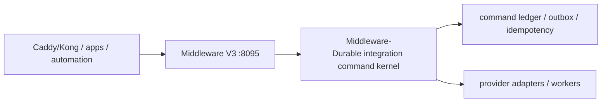
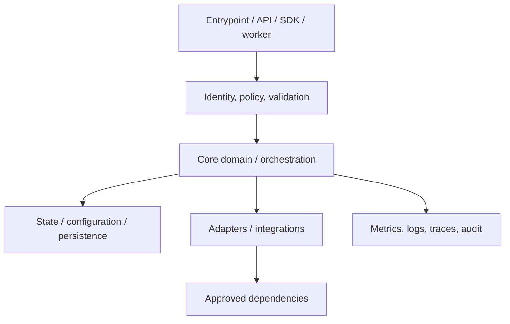
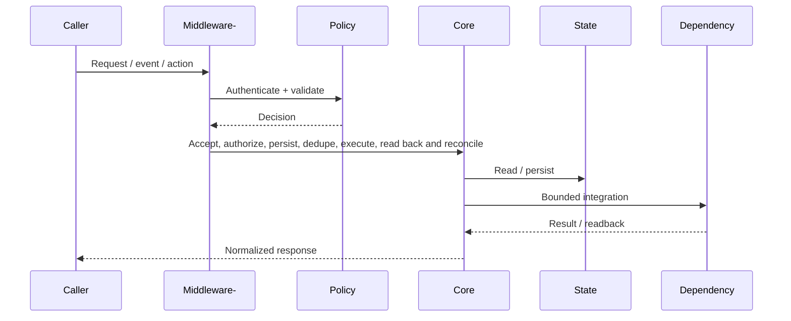
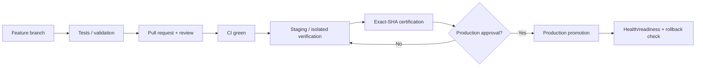
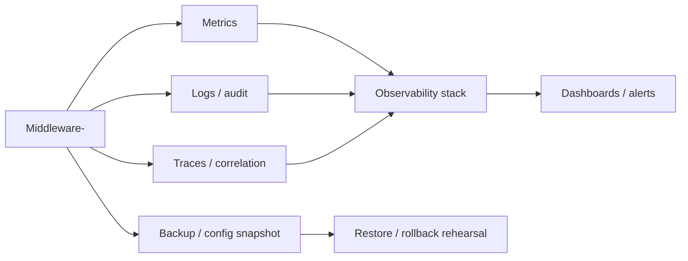

# Middleware- — Architecture Charts

> Repository: `appolon1908/Middleware-`
> Baseline branch: `main`
> Repository-local visual architecture. Update with code, contract and deployment changes.

## 1. System context

## 2. Internal component architecture

## 3. Critical flow

## 4. Deployment and promotion

## 5. Observability and recovery

## Ownership notes
- **Role:** Durable integration command kernel
- **Primary boundary:** Middleware V3 :8095
- **State/config:** command ledger / outbox / idempotency
- **Dependencies/consumers:** provider adapters / workers
- Cross-repository effects must use reviewed contracts; production effects remain separately gated.
