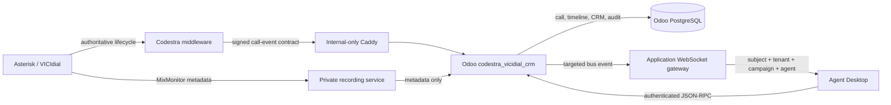
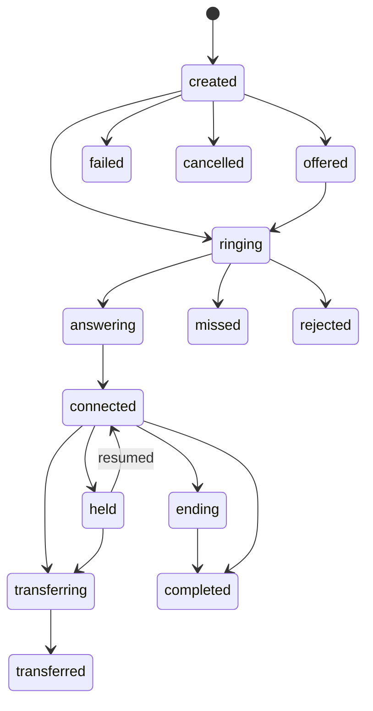

# Codestra Professional Agent Call Workspace

## System boundary

Asterisk/VICIdial remains telephony authority. Odoo is the business record and workspace authority. The browser never receives integration credentials, private recording object identifiers, or a public recording URL. The application WebSocket is distinct from SIP signaling at `wss://wss.codestra.agency:8089/ws`.

## Invariants

- `call_id`, Asterisk unique ID and idempotency keys are unique.
- Event sequence is monotonic. Terminal calls cannot regress to ringing or connected.
- A replayed event ID is accepted only when its canonical payload hash matches.
- Agent RPC calls require Odoo authentication, active telephony mapping, matching tenant, subject, campaign and call owner.
- Supervisor access is the union of tenant and explicitly assigned campaign scope. QA access is tenant-scoped. Submitted QA and note revision evidence is immutable.
- One authenticated WebSocket is allowed per tenant/agent. A secondary browser tab disconnects realtime and clears its workspace.
- External dialing, VICIdial writes, callbacks, SMS, email and production transcription remain disabled during TEST_SYN certification.

## Call lifecycle

Metadata events such as recording availability may arrive after a terminal state without reopening the call.

## Persistence

Odoo models include calls, lifecycle events, note snapshots and immutable revisions, campaign sub-dispositions, callbacks, QA reviews, coaching tasks and integration audit records. Recording blobs stay with the recording authority; Odoo stores restricted metadata references only.

## Realtime recovery

The gateway persists events before delivery. Reconnect uses a last-event cursor. Agent Desktop also calls the authenticated current-call RPC, reloads the full workspace, restores a session-scoped unsent draft and rejects duplicate event IDs/sequences. Server timestamps remain authoritative for displayed timers.

## Observability

Gateway Prometheus metrics cover events received/rejected, duplicate suppression, popup delivery, delivery failures, disconnects, replay and persistence-to-socket latency. Odoo integration audit covers workspace viewed, notes, disposition, callback, CRM open, QA and coaching actions. Queue ASA, abandon, occupancy, adherence and FCR are displayed only when an authoritative queue data source is present.
