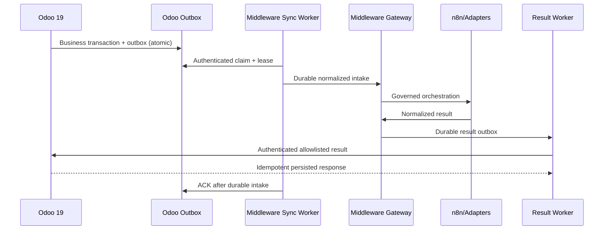

# Odoo–Middleware runtime architecture

The sole event-ownership model is Odoo transactional outbox claim/lease/acknowledgement. Historical direct-push Odoo ingestion is deprecated and must remain disabled. Odoo is authoritative for CRM/business state; middleware owns transport, normalization, retries, idempotency, replay defense, audit, and adapter orchestration. n8n orchestrates normalized events only. VICIdial is a telephony origin and never writes Odoo storage directly.

Production writes require `ODOO_PRODUCTION_WRITES_ENABLED=true` and `LIVE_WRITES_ENABLED=true`; both remain false.
