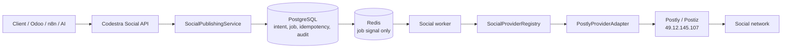
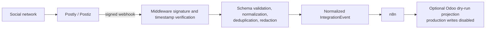
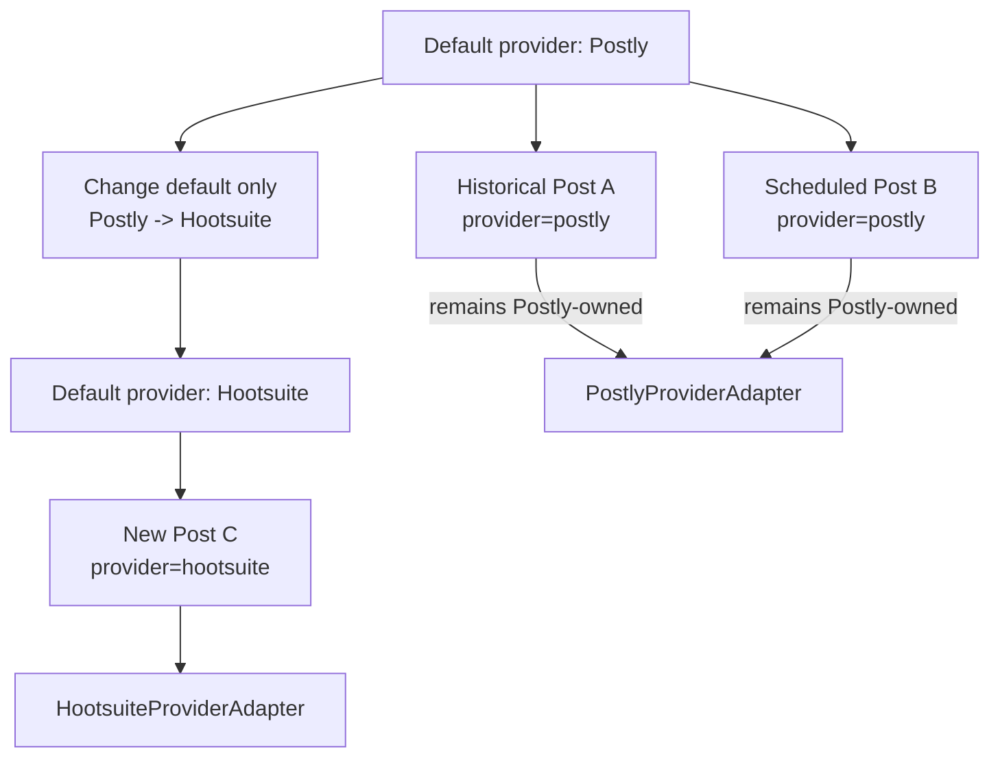
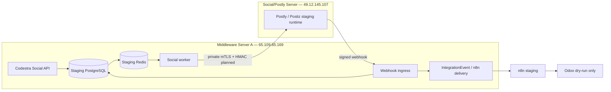

# Codestra Social Publishing Middleware Architecture

## 1. Purpose

The Codestra Social Publishing Middleware is the provider-neutral control plane between Codestra clients and external social-publishing providers. Its purpose is to give Odoo, n8n, AI services, frontends, and internal clients one stable Codestra API while isolating Postly/Postiz, Hootsuite, and future provider details behind adapters.

Phase 1 established the domain contracts, API surface, provider registry, Postly adapter, disabled Hootsuite adapter, database schema, Redis queue abstraction, event projections, security controls, tests, and migration rules. Phase 2 adds an opt-in `SqlSocialRepository`, persistent idempotency and lease migration, durable worker entrypoint, persistent webhook deduplication, and IntegrationEvent wiring. These components remain disabled by default and have not been deployed or authenticated against the remote Postly runtime; production publishing is not enabled.

The architecture follows these principles:

- Codestra owns canonical intent, identity, state, idempotency, and audit evidence.
- Public API contracts are provider-neutral.
- Provider capabilities are discovered and checked explicitly.
- Provider-specific payloads, errors, identifiers, and credentials remain inside adapter boundaries.
- Mutations are asynchronous in the durable topology.
- Safety controls fail closed and default to disabled.
- Historical provider ownership is immutable.
- Provider migration never implies duplicate or dual publishing.
- External systems receive normalized events rather than raw provider callbacks.

## 2. Deployment responsibilities

### Middleware Server A — `65.109.65.169`

Middleware Server A is the Codestra integration control plane. It owns:

- the provider-neutral `/api/v1/social` API;
- request validation, RBAC checks, feature gates, and normalized errors;
- Codestra UUID allocation and account-to-provider reference mapping;
- `SocialPublishingService` orchestration;
- PostgreSQL social intent, job, idempotency, webhook, event, analytics, and audit records;
- Redis job signaling and worker coordination;
- worker dispatch through `SocialProviderRegistry`;
- inbound webhook verification, normalization, deduplication, and redaction;
- normalized `IntegrationEvent` production;
- n8n delivery and the disabled Odoo projection boundary;
- correlation IDs, metrics, audit evidence, retries, reconciliation, and dead letters.

Phase 1 implements the API/domain foundations and schemas on this server but does not deploy them to production.

### Social/Postly Server — `49.12.145.107`

The Social/Postly Server hosts the Postly/Postiz publishing runtime. In the controlled staging topology it is responsible for:

- maintaining provider-side social-network connections and OAuth state;
- accepting authenticated provider requests from Middleware Server A;
- translating Postly/Postiz operations into social-network API calls;
- returning provider request IDs, external post IDs, statuses, and safe errors;
- emitting signed provider webhook events back to Middleware Server A;
- enforcing provider and social-network constraints such as rate limits and media rules.

It is not the canonical Codestra database, CRM, job ledger, idempotency store, or audit system. Postly/Postiz never calls Odoo directly and never becomes the authoritative CRM.

## 3. Main outbound publishing path



The PostgreSQL-to-Redis-to-worker portion is the required durable runtime flow. Phase 2 implements the SQL repository, lease-based worker, recovery scanner, Redis signal abstraction, and provider dispatch locally. Remote staging deployment and Postly validation remain blocked by server access and must pass before activation.

## 4. Codestra Social API

The versioned `Codestra Social API` is the only business-facing social-publishing interface. It provides provider-neutral endpoints for providers, accounts, posts, post lifecycle commands, media, campaigns, analytics, and webhooks.

Clients submit Codestra account and campaign UUIDs. They do not submit `postly_account_id`, `hootsuite_account_id`, provider OAuth tokens, or provider-native request structures. Provider metadata may be carried in an opaque metadata field, but it must not redefine the public contract.

The Phase 1 route implementation validates strict Pydantic request models, requires `Idempotency-Key` for post creation and lifecycle command endpoints, assigns correlation/request IDs, checks social permissions, maps `SocialError` instances into safe error responses, and returns accepted job identifiers. Media upload and all production write paths remain disabled.

## 5. SocialPublishingService

`SocialPublishingService` owns provider-independent business orchestration. It:

- rejects requests when `SOCIAL_INTEGRATION_ENABLED=false`;
- validates required account and content data;
- chooses the configured default provider only when creating a new post;
- resolves existing posts using the provider stored on the post;
- checks capabilities through the registry;
- creates Codestra posts and normalized jobs;
- calculates request hashes and enforces idempotency;
- rejects publish commands when `SOCIAL_PUBLISH_ENABLED=false`;
- dispatches jobs to the owning adapter through `process_job()`;
- maps normalized provider results back to Codestra status;
- records safe audit entries.

It does not generate AI content, handle provider OAuth, expose raw provider payloads, or call n8n/Odoo directly.

## 6. Provider registry and adapter contract

`SocialProviderRegistry` registers known adapters, validates provider names, rejects `disabled` and unknown providers, returns capability sets, and prevents dispatch of unsupported operations. Business logic checks capabilities rather than branching on provider names.

```text
SocialProviderAdapter
├── PostlyProviderAdapter
├── HootsuiteProviderAdapter   [Phase 1: disabled, no outbound implementation]
└── FutureProviderAdapter      [planned]
```

The `SocialProviderAdapter` contract defines:

- `health_check()` and `get_capabilities()`;
- account listing and lookup;
- create, update, schedule, publish, cancel, delete, get, and status operations;
- media upload;
- comment, message, and analytics reads;
- webhook verification and normalization.

An unimplemented operation raises `SOCIAL_PROVIDER_CAPABILITY_UNSUPPORTED`. Provider exceptions must be translated into safe `SocialError` codes before leaving the adapter.

## 7. PostlyProviderAdapter

`PostlyProviderAdapter` is the only Phase 1 component permitted to understand Postly/Postiz request and response shapes. It wraps the existing `PostizClient` and is responsible for:

- API-key authentication through runtime secret configuration;
- normalized request serialization;
- response and status mapping;
- timeout and connection classification;
- rate-limit, authentication, 4xx, and 5xx conversion;
- external account, media, and post references;
- webhook HMAC/timestamp verification;
- webhook event normalization and payload allowlisting.

The adapter is implemented and mock-tested. No real Postly credential or production provider call was used in Phase 1.

## 8. Hootsuite and future providers

`HootsuiteProviderAdapter` is intentionally disabled in Phase 1. It reports `NOT_CONFIGURED` without credential-file configuration and `DISABLED` when configuration exists but outbound support is inactive. Its capability set is empty, so it cannot falsely report successful publishing.

Phase 3 is planned to implement OAuth lifecycle, account discovery, request/response mappings, webhooks, rate limits, and provider-specific status reconciliation. Future providers can implement the same adapter contract without changing the public Social API.

## 9. Identity and provider ownership

Codestra UUIDs are canonical. Provider identifiers are external references only:

```text
social_post.id               = Codestra UUID
social_post.provider         = provider that owns this record
social_post.provider_post_id = external provider post ID, if assigned
```

Account mappings follow the same rule: `social_accounts.id` is canonical, while `(provider, provider_account_id)` identifies the external connection. Provider OAuth tokens are never returned by normal APIs.

Historical ownership invariants:

- Existing Postly records remain Postly-owned after the default changes to Hootsuite.
- Existing Hootsuite records remain Hootsuite-owned after switching back to Postly.
- Historical and already-scheduled records resolve through their stored `provider` field.
- A provider switch never rewrites historical records or globally reinterprets external IDs.
- Newly created posts use the current default provider after capability and feature-gate checks.

## 10. Authoritative persistence and Redis

PostgreSQL is the authoritative source of truth for social intent, accounts, campaigns, posts, jobs, attempts, idempotency, webhook receipt, normalized events, analytics snapshots, and audit records. Migration `0033_social_publishing` creates the corresponding tables and indexes.

Redis is transport infrastructure, not canonical storage. `RedisSocialQueue` carries only `job_id` and `correlation_id` signals, with a separate dead-letter signal list. Loss or eviction of Redis data must not destroy accepted intent or publishing state. A production worker must be able to repopulate or recover work from PostgreSQL.

Current implementation note: API handlers select `SqlSocialRepository` only when `SOCIAL_SQL_REPOSITORY_ENABLED=true`; otherwise the Phase 1 in-memory repository remains available for contract tests. Phase 2 implements transactional intent/outbox insertion, lease/claim processing, and recovery scanning. Source defaults remain off, Redis delivery/outage recovery still requires real staging validation, and production activation is forbidden.

## 11. Worker execution, idempotency, and failure handling

### Execution flow

1. The API authenticates and authorizes the caller.
2. The service validates the provider-neutral command and feature flags.
3. The durable design commits post intent, idempotency record, audit evidence, and a job/outbox record in one PostgreSQL transaction.
4. Redis signals the committed job ID.
5. A worker loads canonical state from PostgreSQL and leases the job.
6. The registry resolves the provider stored on that post.
7. The adapter performs the provider operation.
8. The worker stores the normalized result and emits a normalized event.

Steps 3–8 are implemented as disabled-by-default Phase 2 runtime code and verified with disposable PostgreSQL and provider mocks. They are not yet deployed to either staging server.

### Idempotency and duplicate-publish protection

Post creation and post lifecycle command endpoints require `Idempotency-Key`. Creation requests are scoped by tenant, action, and key so a retry does not need to know the server-allocated post UUID. Commands on an existing post are scoped by tenant, action, post UUID, and key. Reusing a key with a different request hash produces `SOCIAL_IDEMPOTENCY_CONFLICT`.

Workers must also claim jobs atomically and persist terminal provider results before acknowledging queue signals. The same publish operation and key must produce at most one provider publish call. A provider migration flag never authorizes a second call.

### Retry, unknown results, and dead letters

Connection failures, timeouts, temporary provider unavailability, rate limits, and provider 5xx responses are retryable. Validation failures, unsupported capabilities, disconnected accounts, revoked authentication, and permanent provider 4xx responses are non-retryable. `retry_delay()` provides bounded exponential backoff with jitter; `classify_failure()` separates retry from dead-letter outcomes.

If a request may have reached the provider but the response is unknown, the worker must not blindly publish again. The planned reconciliation path uses the stored provider owner, idempotency evidence, provider request/reference IDs, and `get_post_status()` before deciding whether a retry is safe. This unknown-result reconciliation loop is planned, not implemented in Phase 1.

After retry exhaustion, the durable job transitions to failed/dead-letter state with attempt count, safe error code/summary, provider, job/post IDs, correlation ID, and timestamps. Raw stack traces and provider payloads are excluded.

## 12. Inbound webhook and event path



The Postly webhook route is the only bearer-exempt social route. Exemption from bearer authentication does not mean unauthenticated acceptance: `PostlyProviderAdapter.verify_webhook()` requires a configured secret, validates the timestamp window, and compares the HMAC signature in constant time. The adapter then validates identifiers, maps known provider event names to canonical event types, and allowlists safe payload fields.

The API requires a provider event ID and deduplicates repeated deliveries. The durable topology persists `(provider, provider_event_id)` uniqueness before dispatch. Phase 1 deduplication is currently in memory; persistent receipt and replay state are planned with the tables already introduced by migration `0033_social_publishing`.

Provider credentials, tokens, raw payloads, stack traces, and unapproved fields must never appear in events, public errors, logs, audit metadata, or metrics.

## 13. Normalized IntegrationEvent flow

Canonical events include account connection state, post lifecycle, comments, messages, and analytics changes. `n8n_projection()` produces a provider-neutral envelope containing event ID/type/version, occurrence time, correlation ID, tenant ID, source, owning provider, Codestra subject UUID, and a safe payload.

Phase 2 persists normalized provider results and accepted webhooks into the existing `IntegrationEvent` tables. n8n delivery rows are created only when the disabled-by-default staging flag is enabled; real n8n delivery remains unvalidated because remote staging access is blocked.

## 14. n8n, Odoo, and AI boundaries

### n8n

n8n receives normalized middleware events. It never receives provider credentials and does not need to understand Postly or Hootsuite response schemas. Providers do not call n8n directly for core workflows. `SOCIAL_N8N_EVENTS_ENABLED=false` prevents projection by default.

### Odoo

Odoo consumes provider-neutral Codestra projections only. Postly and Hootsuite never call Odoo directly and never become the authoritative CRM. `odoo_projection()` returns no projection when sync is disabled and only a dry-run DTO when enabled under current safety policy. `Settings.validate_safety()` rejects `SOCIAL_ODOO_WRITE_ENABLED=true`.

Production Odoo social writes remain disabled, and Phase 1 changes zero Odoo records.

### AI

AI services may generate, rewrite, translate, classify, or suggest social content before submitting a provider-neutral command. AI logic must remain outside `SocialProviderAdapter` implementations. Adapters only communicate with publishing providers; they do not select models or generate content.

## 15. Authentication, authorization, and trust boundaries

The global middleware request guard retains bearer authentication for Social API routes. The Phase 1 routes add permission checks for `social.read`, `social.write`, `social.publish`, `social.schedule`, `social.cancel`, `social.delete`, `social.accounts.read`, and `social.analytics.read`, with `social.admin` as an explicit override. These are RBAC foundations; integration with authoritative identity claims must be completed before production exposure.

For Codestra-controlled machine requests, `verify_codestra_signature()` supports timestamp, nonce, HMAC signature, and replay checks. Phase 2 private server-to-server communication should use the strongest established middleware control, preferably mTLS plus HMAC and a dedicated identity such as `postly-social-01`.

Trust boundaries:

1. **Caller → Middleware:** bearer/machine identity, permission checks, size limits, strict schema validation, idempotency, and correlation IDs.
2. **Middleware → PostgreSQL/Redis:** private infrastructure access; PostgreSQL is canonical and Redis is disposable signaling state.
3. **Middleware → Postly/Postiz:** private authenticated transport; credentials are loaded at runtime and stay inside the adapter/client boundary.
4. **Postly/Postiz → Social networks:** provider-owned OAuth and platform constraints.
5. **Postly/Postiz → Middleware webhook:** provider-native HMAC, timestamp window, schema validation, deduplication, and redaction.
6. **Middleware → n8n/Odoo:** normalized events only, separately authenticated and feature-gated.

Provider credentials must never appear in public APIs, logs, audit metadata, normalized events, or metric labels.

## 16. Correlation, audit, and observability

API commands preserve `correlation_id`, `request_id`, `job_id`, Codestra post ID, tenant, and provider owner. Audit records include actor, action, post/campaign/provider references, result, safe error code, and an idempotency-key hash rather than the raw key.

Prometheus metric definitions cover publish requests/results/duration, provider requests/errors/rate limits, webhook acceptance/rejection, queue depth, retries, and dead letters. Labels are limited to low-cardinality provider, network, and result values; account IDs and PII are prohibited.

The durable runtime must make this chain traceable:

```text
API request -> PostgreSQL intent/outbox -> Redis signal -> worker
-> provider request -> webhook -> normalized event -> n8n -> optional Odoo projection
```

## 17. Feature flags and fail-closed behavior

The relevant defaults are:

```dotenv
SOCIAL_INTEGRATION_ENABLED=false
SOCIAL_PUBLISH_ENABLED=false
SOCIAL_PROVIDER=disabled
SOCIAL_PROVIDER_MODE=single
SOCIAL_PROVIDER_MIGRATION_MODE=disabled
POSTIZ_DELIVERY_ENABLED=false
HOOTSUITE_ENABLED=false
SOCIAL_N8N_EVENTS_ENABLED=false
SOCIAL_ODOO_SYNC_ENABLED=false
SOCIAL_ODOO_WRITE_ENABLED=false
SOCIAL_ANALYTICS_SYNC_ENABLED=false
```

Unknown or disabled providers fail safely. Unsupported capabilities fail explicitly. Missing webhook secrets reject inbound webhooks. Hootsuite exposes no outbound capabilities. Production social publishing remains disabled until separately approved, and Hootsuite outbound behavior remains disabled until Phase 3.

## 18. Provider migration architecture



A Postly-to-Hootsuite migration imports or creates separate Hootsuite account mappings, validates capabilities, and changes the default used for new records. It does not reinterpret existing external IDs. Already-scheduled Postly jobs remain Postly-owned; migration requires explicit operator decisions to cancel/recreate them if provider transfer is desired.

Switching back follows the same rule: Hootsuite history remains Hootsuite-owned while only new posts use Postly. Rollback changes the default back; it does not rewrite history.

**Automatic dual publishing is prohibited.** `shadow`, `canary`, or `dual-read` may be designed later, but none may cause the same content to publish through two providers without a separate, explicit, authorized operation. `SOCIAL_PROVIDER_MIGRATION_MODE` defaults to `disabled` and currently has no active routing behavior.

## 19. Phase 2 — Controlled Staging Topology

Phase 2 is planned and must not be interpreted as current production capability.



Phase 2 will validate:

- real private authenticated communication between the two servers;
- Postly account discovery and Codestra account mapping;
- controlled staging draft creation;
- controlled staging scheduling and cancellation;
- PostgreSQL-backed intent/job/idempotency persistence;
- Redis worker signaling, lease, recovery, and replay behavior;
- signed webhook round-trip and persistent deduplication;
- normalized n8n event delivery;
- timeout, rate-limit, unknown-result, retry, and dead-letter recovery;
- provider health monitoring;
- zero production Odoo writes and zero production social publishing.

Phase 3 will implement and validate Hootsuite outbound behavior and provider-migration canaries without changing the Codestra Social API.

## 20. Failure-domain behavior

| Failure domain | Required behavior | Current Phase 1 status |
|---|---|---|
| Postly/Postiz unavailable | Preserve canonical job/post state; classify safe retries; apply bounded backoff; reconcile unknown results before republishing; dead-letter after exhaustion. | Error mapping and retry classification exist; durable worker/reconciliation loop is planned. |
| Redis unavailable or lost | Do not lose accepted intent; recover signals from PostgreSQL; do not treat Redis as evidence of publication. | Redis carries job IDs only; PostgreSQL recovery wiring is planned. |
| PostgreSQL unavailable | Reject new durable mutations; do not call providers without committed intent/idempotency/audit state; workers stop or retry database access safely. | Schema exists; SQL repository/runtime gate is planned. |
| n8n unavailable | Provider result remains committed; normalized event remains pending for later delivery; publishing is not rolled back or repeated. | Projection exists and is disabled; durable delivery wiring is planned. |
| Odoo unavailable | Social state remains valid in middleware; dry-run/event projection retries independently; provider must never call Odoo. | Projection is dry-run only and disabled by default. |

No downstream outage may authorize bypassing idempotency, provider ownership, feature flags, or credential controls.

## 21. Architecture invariants

- Public Social API contracts remain provider-neutral.
- Clients use Codestra UUIDs, never provider IDs as canonical identifiers.
- Existing Postly records remain Postly-owned after switching the default provider.
- Existing Hootsuite records remain Hootsuite-owned after switching back.
- A provider switch never rewrites historical records.
- A provider switch never automatically causes dual publishing.
- PostgreSQL remains authoritative for intent, jobs, idempotency, audit, and state in the durable runtime.
- Redis loss must not destroy canonical social-publishing state.
- Provider credentials never appear in public APIs, logs, audit metadata, events, or metrics.
- Postly and Hootsuite never call Odoo directly.
- Postly and Hootsuite never become the authoritative CRM.
- Production Odoo social writes remain disabled.
- Production social publishing remains disabled until separately approved.
- Hootsuite outbound behavior remains disabled until Phase 3.

## 22. Rollback principles

Phase 1 has not been deployed, so code rollback is a normal revert of the feature commit. If migration `0033_social_publishing` is later applied in an approved non-production environment, preserve required audit evidence, verify no later migration depends on it, and downgrade only through the documented Alembic path.

Operational rollback changes feature flags or the default provider; it does not delete history, reinterpret external IDs, migrate already-scheduled jobs silently, enable dual publishing, rotate production credentials, or modify Odoo records. Any provider-side cancellation or recreation must be explicit, idempotent, auditable, and separately authorized.
